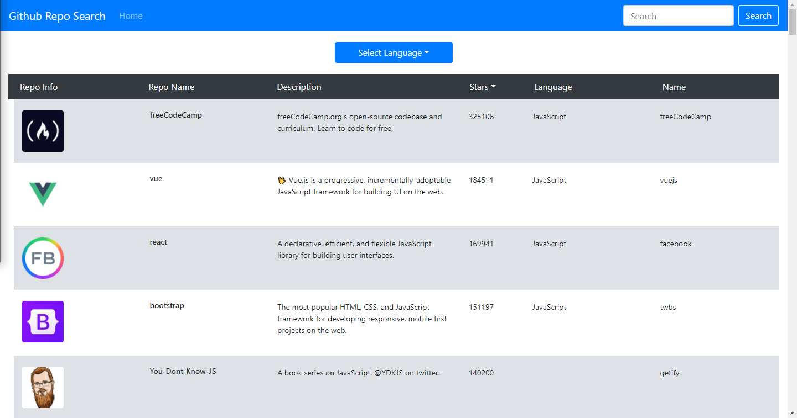

# Hotel Engine Test - Build Web Application and List Github Repos from API

## Table of Contents

- **[Description](#Description)**
- **[Installation Requirements](#Installation-Requirements)**
- **[License](#License)**
- **[Questions](#Questions)**

# Description

The objective is to build a GitHub Repository search application using the gitHub repository search API (https://docs.github.com/en/rest/reference/search#search-repositories) that displays the results of a query. The app can query the API directly. The list should be able to sort by GitHub's default sort key (best match) and number of stars and also should be able to filter by language.
Each result when selected should route to a detailed screen that displays information about the repository. The results should contain the repository name, description, number of stars, language, and the owners name. You can include more information as you see fit to enhance the UI.
Finally, the app should be fully responsive and follow best practices in implementing a responsive website.

## Deployed Site @

---

# Technology Used

- [GitHub API](https://docs.github.com/en/rest/reference/search#search-repositories)
- [React](https://reactjs.org/)
- [Axios](https://axios-http.com/)
- [Bootstrap](https://getbootstrap.com/)
- [React-Bootstrap](https://react-bootstrap.github.io/)
- [Emotion CSS](hhttps://emotion.sh/docs/introduction)

# Installation Requirements

1. Clone repository in the command line by entering: git clone https://github.com/jaredseefried/hotel-engine-test.git

2. Install required libraries from entering in the command line: npm i

3. Start the application by entering in the command line: npm start

# License

MIT

# Have Questions?

## [Github Profile: github.com/jaredseefried](https://github.com/jaredseefried "Title")

Please email me at jared.seefried@yahoo.com if you have additional questions.
